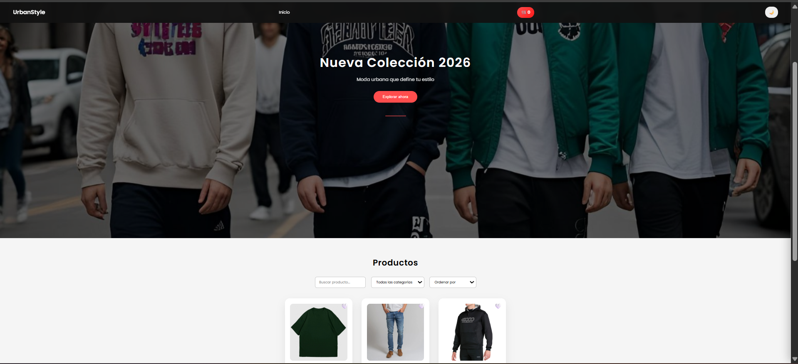
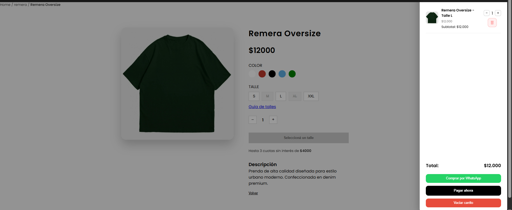

# 🛍️ UrbanStyle - Online Clothing Store

UrbanStyle es una tienda online desarrollada con **HTML, CSS y JavaScript** que permite explorar productos y gestionar un carrito de compras.

## 🚀 Demo

urbanstylespa.netlify.app

## 📸 Preview
### 🏠 Página principal

### 👕 🛍 Vista de producto

### 💳 Forma de pago 

## 🛠 Tecnologías

- HTML
- CSS
- JavaScript
- JSON

## ✨ Características

- Catálogo de productos
- Carrito de compras
- Sistema de favoritos
- Diseño responsive

## 📂 Estructura del proyecto

img/
index.html
styles.css
productos.json
carrito.js
favoritos.js
main.js
ui.js

## 👨‍💻 Autor

Alexis Gonzalez
