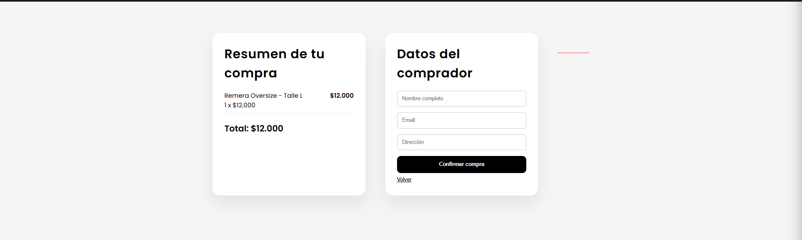

# 🛍 UrbanStyle - Online Clothing Store

UrbanStyle es una tienda online desarrollada con **HTML, CSS y JavaScript** que permite explorar productos, agregarlos al carrito y gestionar favoritos.

Este proyecto fue creado como parte de mi práctica en desarrollo web frontend.

---

# 🚀 Live Demo

🌐 urbanstylespa.netlify.app

---

# 🛠 Tecnologías utilizadas

- HTML
- CSS
- JavaScript
- JSON

---

# ✨ Características

✔ Catálogo de productos  
✔ Carrito de compras  
✔ Sistema de favoritos  
✔ Interfaz responsive  
✔ Gestión de productos desde JSON  

---

# 📸 Preview del proyecto

## 🏠 Página principal

## 🛍 Vista de producto

## 💳 Forma de pago

---

# 📂 Estructura del proyecto

urbanstyle-spa
│
├── img
├── index.html
├── styles.css
├── productos.json
├── carrito.js
├── favoritos.js
├── main.js
└── ui.js

---

# 👨‍💻 Autor

**Alexis Gonzalez**

- GitHub: https://github.com/Maxiii579
- LinkedIn: (www.linkedin.com/in/alexis-gonzalez-b9005a267)

---

# 📌 Próximas mejoras

- Sistema de login de usuario
- Integración con pasarela de pago
- Base de datos para productos

Alexis Gonzalez
